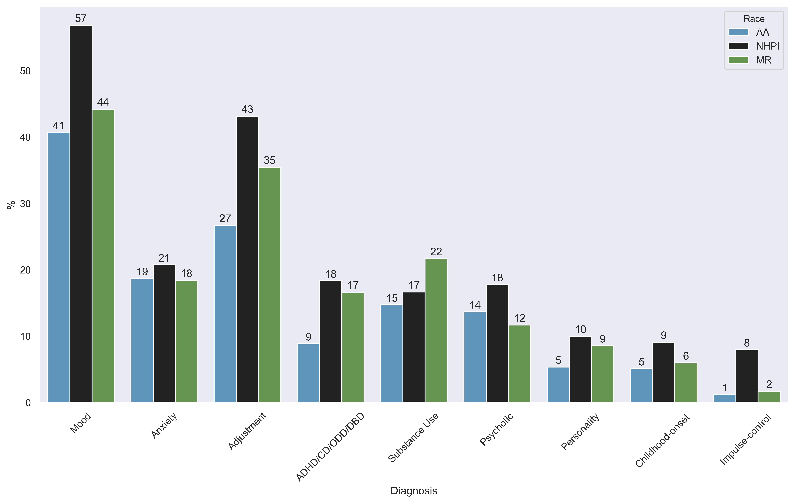

## Table 1: Selected Characteristics
Selected characteristics of Asian Americans, Native Hawaiians/Pacific Islanders, and mixed-race people.
### Overview
#### Race

|   **M**R |   AA |   NHPI |
|-----:|-----:|-------:|
| 2988 | 2018 |    540 |

#### Age

|   **18-34** |   **35-49** |   **12-17** |   **50+** |   **1-11** |
|--------:|--------:|--------:|------:|-------:|
|    1611 |    1077 |    1077 |   923 |    858 |

#### Sex

|    **F** |    **M** |   **Others** |
|-----:|-----:|---------:|
| 2982 | 2561 |        3 |

### Age-Race
| Age   | **M**R               | AA               | NHPI             |
|:------|:-----------------|:-----------------|:-----------------|
| **18-34** | 26.5 (24.9-28.1) | 34.3 (32.2-36.4) | 23.7 (20.1-27.3) |
| **50+**   | 15.3 (14.0-16.6) | 18.0 (16.4-19.7) | 18.7 (15.4-22.0) |
| **35-49** | 16.9 (15.6-18.2) | 23.5 (21.7-25.4) | 18.0 (14.7-21.2) |
| **1-11**  | 20.0 (18.6-21.5) | 9.1 (7.8-10.3)   | 14.1 (11.1-17.0) |
| **12-17** | 21.3 (19.8-22.7) | 15.1 (13.5-16.6) | 25.6 (21.9-29.2) |

### Sex-Race 
| Sex    | **M**R               | AA               | NHPI             |
|:-------|:-----------------|:-----------------|:-----------------|
| **M**      | 47.3 (45.5-49.0) | 44.0 (41.8-46.2) | 48.3 (44.1-52.5) |
| **F**      | 52.6 (50.9-54.4) | 56.0 (53.8-58.2) | 51.7 (47.5-55.9) |
| **Others** | 0.1 (-0.0-0.2)   | 0.0 (0.0-0.0)    | 0.0 (0.0-0.0)    |
## Figure 1: DSM-IV
DSM-IV mental diagnoses among Asian Americans, Native Hawaiians/Pacific Islanders, and mixed-race people.

